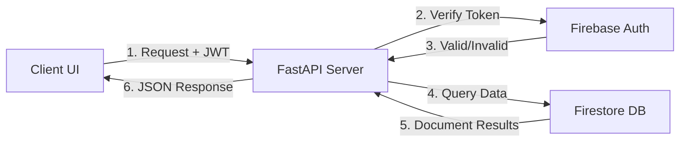
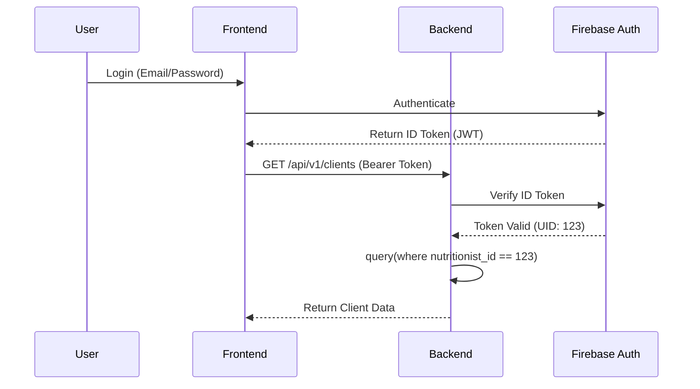

# 🍏 AnyFeast: Backend System Documentation

## 1. System Architecture Overview
The AnyFeast backend is built using a modern, scalable architecture designed for high-performance and asynchronous processing. 

| Component | Technology | Role |
| :--- | :--- | :--- |
| **Framework** | **FastAPI (Python)** | High-performance REST API routing and logic. |
| **Authentication** | **Firebase Auth** | Secure user management and JWT validation. |
| **Database** | **Google Cloud Firestore** | NoSQL Document Store for real-time data scalability. |
| **Validation** | **Pydantic** | Schema enforcement and data integrity. |

---

## 2. API Route Specifications
All endpoints follow the base URL: `/api/v1/`

### 📋 Client Management (`/clients`)
| Method | Endpoint | Description | Request (JSON) | Response (JSON) |
| :--- | :--- | :--- | :--- | :--- |
| **GET** | `/` | List all nutritionist's clients | None | `[{"id": "...", "name": "..."}]` |
| **POST** | `/` | Create a new client profile | `ClientCreate` | `ClientResponse` object |
| **GET** | `/{id}` | Fetch detailed client profile | None | `ClientResponse` object |
| **PUT** | `/{id}` | Update client info/goals | `ClientCreate` | Updated `ClientResponse` |
| **DELETE**| `/{id}` | Remove client from records | None | `204 No Content` |

### 🍱 Meal Planning (`/mealplans`)
| Method | Endpoint | Description | Request (JSON) | Response (JSON) |
| :--- | :--- | :--- | :--- | :--- |
| **POST** | `/` | Save a new 7-day plan | `MealPlanCreate` | Created Plan with ID |
| **GET** | `/?client_id=X` | Get plans for specific client | None | `List[MealPlan]` |

---

## 3. Authentication Workflow
AnyFeast utilizes **Stateless Authentication** via Firebase.

### The Lifecycle:
1. **Frontend Action**: User enters credentials. Firebase SDK validates and returns an **ID Token (JWT)**.
2. **Request Header**: The client sends the token in the `Authorization` header.
   - `Authorization: Bearer <ID_TOKEN>`
3. **Backend Middleware**: The `get_current_user` dependency intercepts the request.
4. **Validation**: The backend calls `auth.verify_id_token()` to verify authenticity with Google servers.
5. **Context**: If valid, the `uid` of the nutritionist is injected into the route controller.

---

## 4. Database Schema (Firestore NoSQL)
We use a **Document-Oriented** structure where every record is associated with a `nutritionist_id` to ensure data isolation.

### Collection: `clients`
```json
{
  "id": "autogenerated_id",
  "nutritionist_id": "firebase_uid",
  "personal_info": {
    "first_name": "Ishan",
    "last_name": "Chhabra",
    "email": "ishan@example.com"
  },
  "goals": ["Weight Loss", "Muscle Gain"],
  "measurements": { "height_cm": 180, "weight_kg": 75 },
  "created_at": "ISO-TIMESTAMP"
}
```

---

## 5. Visual Flowchart Diagrams

### 🛠 Request-Response Lifecycle


### 🔐 Authentication Sequence


---

## 6. Error Handling Strategy
Standardized HTTP Status Codes are used to provide clear feedback.

| Code | Type | Reason |
| :--- | :--- | :--- |
| **200/201** | Success | Request processed correctly. |
| **400** | Bad Request | Validation error (invalid JSON format). |
| **401** | Unauthorized | Token missing or expired. |
| **403** | Forbidden | Trying to access a client belonging to another nutritionist. |
| **404** | Not Found | Requested resource (Client/Plan) does not exist. |
| **500** | Server Error | Database connection failure or unhandled exception. |

---

## 7. Development & Deployment
- **Local Runner**: `uvicorn main:app --reload`
- **Environment**: Configuration managed via `.env` and `core/config.py`.
- **Requirements**: Managed via `requirements.txt` listing `fastapi`, `firebase-admin`, etc.
